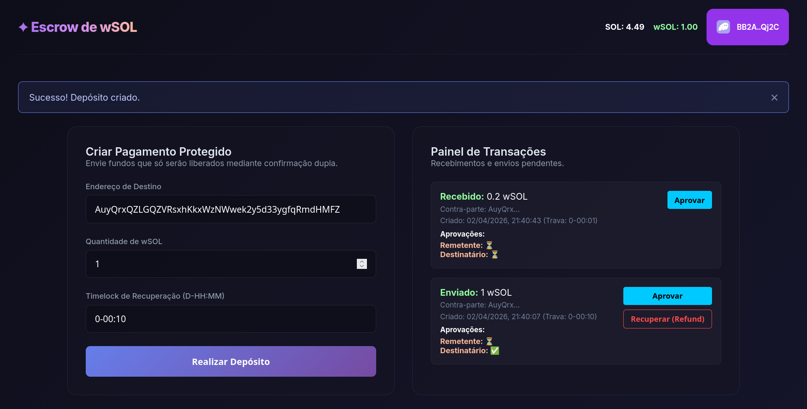

# ✦ Escrow de wSOL (Solana dApp)

O **Escrow de wSOL** é um aplicativo distribuído (dApp) focado em **Pagamentos com Retenção (Timelock/Escrow Unilateral)**, atualmente configurado para rodar na rede **Devnet** da Solana.

Criado com Rust/Anchor (Contratos Inteligentes) e Next.js (Interface Gráfica), este sistema visa extinguir o risco de calote ou de insatisfação num acordo, bloqueando fundos *on-chain* de forma que eles sejam liberados apenas mediante **Aprovação Mútua**.



---

## 🔑 Identificação do Contrato (Program)

**Devnet Program ID:** `5AQuMCykC6W5fH5JWoajGtQ6VT2MUYVsDHQdmut2NPZv`

---

## 💡 Como Funciona (A Lógica Central)

Este Escrow opera de forma **Unilateral com Dupla Assinatura**. 

1. O **remetente** deposita **wSOL** no cofre virtual (*Vault*) da *Blockchain* em nome do **destinatário** e define um tempo mínimo durante o qual os fundos ficarão disponíveis (*timelock*).
2. Quando o **destinatário** conecta sua *wallet* no dApp, ele consegue visualizar os depósitos em seu nome que estão aguardando aprovação.
3. Somente quando ambos clicarem em **aprovar** e assinar a transação é que os tokens serão liberados para o **destinatário**. O programa confere as assinaturas digitais dos dois antes de destravar o *vault*.

Isso é ideal para o mercado de *freelancers* ou prestadores de serviço: o Cliente (remetende) prova que tem o dinheiro através do depósito no *vault on chain*. O *freelancer* (destinatário) executa a tarefa. Quando o trabalho for entregue, o *freelancer* assina a transação. Após aprovação da entrega, o cliente também assina a transação. Assim que ambos assinarem, os *tokens* são liberados para o *freelancer*.

### Escudo Anti-Golpes (Refund)
- O remetente pode configurar um prazo limite rotulado de `Timelock`.
- Se o acordo for quebrado e nenhuma aprovação definitiva acontecer, a própria *blockchain* impede que a transação fique no limbo. Assim que expirar o *timelock*, o dApp libera a trava e o remetente consegue fazer um **estorno total** (*refund*), recuperando seus wSOL de dentro do *vault*.

---

## 🚀 Como usar o dApp

Este repositório atende a três objetivos principais para os desenvolvedores:
- Validar as regras de segurança através da suíte de testes do *smart contract*
- Rodar a interface gráfica (*frontend*) acoplando as requisições ao contrato que já está publicado na *devnet* Solana.
- Publicar o código-fonte do *smart contract*.

### Pré-requisitos
- [Solana CLI](https://docs.solana.com/cli/install-solana-cli-tools) e [Anchor CLI](https://www.anchor-lang.com/docs/installation)
- Node.js e Yarn instalados
- Extensão Web da Phantom Wallet apontada para a *Devnet*

### 1. Validando a Segurança (Execução dos testes)
Para rodar a bateria de testes na sua máquina, execute:
```bash
yarn install
anchor build
anchor test
```

### 2. Rodando o front-end (Aplicação Next.js)
A comunicação RPC já está fixamente apontada para o Program ID oficial na Devnet. Para interagir com ele através da tela gráfica, inicie o servidor local:
```bash
cd app
yarn install
yarn dev
```
Por fim, acesse o `http://localhost:3000`.

### 3. Alimentando sua wallet com wSOL
Como este Escrow retém e movimenta moedas em forma de SPL-Tokens, usaremos o **wSOL** nas transações. Para testar depósitos fictícios pela sua carteira wallet (por exemplo, Phantom), crie dinheiro de testes e transforme-os em token:

```bash
solana airdrop 5 <COLE_AQUI_A_CHAVE_PUBLICA_DO_SEU_PHANTOM>
spl-token wrap 4 --fee-payer ~/.config/solana/id.json --owner <COLE_AQUI_A_CHAVE_PUBLICA_DO_SEU_PHANTOM>
```

Fique à vontade também para usar *faucets* alternativos da internet como `https://faucet.solana.com/`. Nesse caso, use comandos de terminal `spl-token wrap` na sequência para transformar SOL em wSOL.

Com isso, o app mostrará seu saldo no canto superior direito da aplicação e o cofre aceitará fundos da sua carteira!

IMPORTANTE! Lembre-se de que você precisará de **SOL** para pagar as taxas da rede para depositar **wSOL** no *vault*.

---

## 🔮 Visão de Futuro e Escalabilidade (Roadmap)

Embora a infraestrutura unilateral com dupla aprovação já sustente perfeitamente o B2B e o mercado de freelancers, existem diversas rotas atrativas para expandir o ecossistema do **wSOL Escrow**:

### 1. Tribunal Descentralizado (Multi-Sig para Disputas)
Adicionar a possibilidade de inserir a chave pública de um **árbitro** no momento da formulação do pagamento. Em eventuais divergências sobre o trabalho realizado, um botão de "Disputa" transferiria a decisão final de liberar os tokens para o destinatário ou retorná-los para o remetende.

### 2. Contratos com Dados "Vivos" (Oráculos & Agentes de IA Autônomos)
A aprovação não precisa depender do clique humano!
- **Oráculos:** Usar pontes de informação (como Switchboard) para acionar os pagamentos de acordo com dados retornados por APIs que trazem dados do mundo real para a blockchain. Exemplo: Uma vault pode ser criada ao comprar algo de uma loja ou outra pessoa pela internet. Quando os Correios baterem no status 'Entregue no CEP X', aciona o oráculo que se comunica com o Escrow que automaticamente dispara o `Approve` e libera os tokens à loja."
- **Agentes Analistas de IA:** Para equipes de software e bounties, uma I.A. dedicada e com sua própria `PublicKey` poderia ser a Juíza, capaz de revisar o código que você entregou num repositório e atirar o pagamento da recompensa liberando os wSOL após detectar um "Merge" bem sucedido sem falhas de arquitetura.

### 3. Juros Compostos no Cofre (Yield-Bearing Vaults)
Alguns acordos ou contratos envolvem pagamentos que podem ficar travados por meses ou até anos. Em vez do dinheiro ficar inerte na vault, é possível plugar o dApp diretamente ao ecossistema DeFi, como **Kamino Finance** por exemplo, rentabilizando os tokens enquanto permanecem no cofre através de operações de lending ou até alimentando pools de liquidez. O rendimento gerado seria convertido poderia ser retirado como pagamento pelo serviço prestado (sem onerar o usuário) ou poderia ser oferecido aos usuários do dApp como uma forma de incentivar seu uso.

### 4. Swap Transparente Cross-Token
Na hora de receber os tokens da vault, o destinatário poderia selecionar um token diferente do que está na vaul para receber (Exemplo: Remetende depositou USDC e destinatário quer receber em wSOL). Nesse caso, poderia ser feito um roteamento para a agregadora **Jupiter Swap**. Isso permitiria que o remetende recebesse através das dezenas de pools da própria infraestrutura de DEX da Solana de forma totalmente abstraída para o usuário final.
